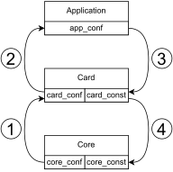

.. _ndk_core_configuration:

Parametrizing NDK-CORE design
=============================
The files in the ``<NDK-CORE_root_directory>/intel/config`` directory and the
``<NDK-CORE_root_directory>/intel/core.mk`` file contain CORE parameters. Some
of these parameters are configurable (more info below). The sourcing of
configuration parameter files has its own hierarchy, which is shown in the
:ref:`fig_const_hierarchy`. This page describes the
configuration files used in the case of NDK-CORE design. For the description of
the application and card-specific configuration, see
:ref:`ndk_core_conf_furth_read` on the end of this page.

.. _fig_const_hierarchy:

    Hierarchy diagram

    Numbers show the order in which these parameter files are sourced. Sourcing
    takes place in the `core_boostrap.tcl` file.

File description
-----------------

.. _ndk_core_conf_core_conf_tcl:

core_conf.tcl
^^^^^^^^^^^^^
This file provides a listing of all parameters that can be changed by the user.
Each parameter contains a comment with allowed values and the meaning of
these values. Because the NDK-CORE design is independent of the underlying
platform (e.g. card type) there are many allowed combinations of parameters.
However, the user can find many combinations of parameters that are unsupported
and may cause errors during the synthesis/implementation process. The user can add
other configuration parameters to this file according to their need.

.. _ndk_core_conf_core_const_tcl:

core_const.tcl
^^^^^^^^^^^^^^
.. WARNING::
    This file contains parameters that should not be changed deliberately by the
    user. They are for development purposes only.

The first purpose of this file is to pass the values of specific parameters to
the VHDL package which is included as a part of the FPGA design. Parameters
specified in the ``core_conf.tcl`` are visible in this file and so are the
parameters specific for the chosen card type. Passing TCL parameters to VHDL
constants is a specific use case described in the :ref:`core_config_vhdl_pkg_const`
section below.

Another purpose to insert parameter in this file is when its value
depends on the value of another constant, but only if they are relevant to
the NDK-CORE design. Conditionally assigned parameters that are for a specific
card type should be located in a corresponding :ref:`card_conf_card_const_tcl`
file. Example a conditional assignments follows:

.. code-block:: tcl

    # disabling of the PTC module when specific PCI Express configuration is used
    if {$PCIE_ENDPOINTS == 3 && $PCIE_ENDPOINT_MODE == 2} {
        set PTC_DISABLE true
    } else {
        # always insert default value
        set PTC_DISABLE false
    }

.. _core_mk_include:

core.mk
^^^^^^^
This file contains default values for the parameters specified in the Makefile.
The allowed values of each parameter are
provided in the comments. The user of the
design can change these values freely.

core_bootstrap.tcl
^^^^^^^^^^^^^^^^^^
.. WARNING::
   The features in this file are for development and should not be changed.

This file loads all necessary path variables from the environment. Then are
sourced all configuration files described in the :ref:`fig_const_hierarchy`. The
files with the lowest priority are sourced first and the ones with the highest
priority last. The ``core_const.tcl`` file has the highest priority.

Further work with parameters
----------------------------
.. WARNING::
   These features are for development and should not be used in regular
   application use.

Developing a new design often requires working with configuration
parameters during compilation/synthesis of the VHDL source files. For this purpose,
there are two mechanisms provided for passing the parameters specified in the
TCL shell to affect the final VHDL design.

Passing through Modules.tcl
^^^^^^^^^^^^^^^^^^^^^^^^^^^
As described in the :ref:`ofm_build_system` section, the Modules.tcl files allow
for modular and hierarchical organization of VHDL source files. The Modules.tcl files
provide an ARCHGRP list to pass specific constants across the source file hierarchy. Each
Modules.tcl file obtains such a list from its parent Modules.tcl file. It allows further
adjustments of the ARCHGRP list(s) of its descendant(s).

The parameters specified in the NDK-CORE repository are passed using the
``CORE_ARCHGRP`` associative array. The array is initialized in the
``<NDK-CORE_root_directory>/intel/common.inc.tcl`` file. Parameters are specified in
the ``core_conf.tcl`` and ``core_const.tcl`` files. This means that the configuration
parameters of a chosen card are visible in this file and can be added to the
array. The associative array was chosen for clarity purposes. Because the
ARCHGRP is declared as a simple list, the associative array is converted to it
and added to the ``FPGA`` entity. As the ARCHGRP list is passed through
the hierarchy, it is converted back
to the associative array when a specific array value is needed. An example is shown in the
``<NDK-CORE_root_directory>/intel/Modules.tcl`` file.

.. _core_config_vhdl_pkg_const:

Adding constants to the VHDL package
^^^^^^^^^^^^^^^^^^^^^^^^^^^^^^^^^^^^
A dynamic VHDL package is generated each time a user starts
building a new design. The package is called ``combo_user_const`` and
contains all parameters which were added in the ``core_const.tcl`` file described
previously. The values are passed to the VHDL package with specific types using
TCL procedures in the VhdlPkgGen.tcl script. This script can be found in the build folder
in the OFM repository (:ref:`ofm_build_system`). Examples of some procedures are
provided in the following code block:

.. code-block:: tcl

    # passing TCL parameters
    VhdlPkgString FANCY_STRING $FANCY_STRING

    VhdlPkgInt SOME_INTEGER $SOME_INTEGER

    VhdlPkgBool SOME_BOOLEAN $SOME_BOOLEAN

    # passing specific values
    VhdlPkgBool IMPORTANT_BOOLEAN true

    VhdlPkgHexVector LARGE_VECTOR 64 ABCDEF0123456789

.. NOTE::
   It is recommended to pass TCL parameters to the VHDL package with the same
   name.

.. _ndk_card_configuration:

Parametrizing a specific card type
==================================
The resulting design of the NDK application depends on the underlying
platform, e.g., the card type on which the design should run. The build system
provides a mechanism to specify card parameters that can overwrite some parameters
specified in the configuration of `NDK-CORE`.

File description
----------------
The file structure is similar to the one described in the configuration of the
`NDK-CORE` design.

card_conf.tcl
^^^^^^^^^^^^^
This file lists user changeable parameters and their allowed
values in the comments. The purpose of this file is the same as of the
``core_conf.tcl`` file in the `NDK-CORE` repository. The only difference is that it has a higher priority.

card_const.tcl
^^^^^^^^^^^^^^
.. WARNING::
   This file contains features for development. It is not recommended for the user to change
   the parameters in this file.

This file contains card-specific parameters which mostly depend on the features
of the physical hardware (the target card). It sources all
other configuration files described in the :ref:`fig_const_hierarchy`.
The order of sourcing the files is from the lowest priority to the highest. The
``card_const.tcl`` file has the highest priority. Hence, before the generation
of the VHDL package, it should also check the configuration
parameters for whether their values are valid and compatible with the values of
the other parameters.

card.mk
^^^^^^^
.. WARNING::
   This file contains features for development. It is not recommended for the user to change
   the parameters in this file.

This part of the Makefile sources all environment variables used
during the initial stage of the build process. The majority of the variables contain
paths to various locations from which the design is sourced/built. There are also
build-specific variables that further parametrize the design. The purpose of
these is described in the :ref:`app_config_makefile` section.

Further work with parameters
----------------------------
.. WARNING::
   These features are for development and should not be used in regular
   application use.

Passing the parameter values to other parts of the design or build system is
very similar to the case of `NDK-CORE`.

Passing through Modules.tcl
^^^^^^^^^^^^^^^^^^^^^^^^^^^
The card-specific parameters are passed to the Modules.tcl file of the top-level
entity using the ``CARD_ARCHGRP`` associative array. This array is initialized in
the ``<card_root_directory>/src/Vivado.inc.tcl`` file for Xilinx-based cards and
in ``<card_root_directory>/src/Quartus.inc.tcl`` for Intel-based cards. The
``CARD_ARCHGRP`` array is concatenated with ``CORE_ARCHGRP`` so the top-level
Modules.tcl file shares parameters of them both. The parameters specified
in the `core_conf.tcl`, `core_const.tcl`, `card_conf.tcl` and `card_const.tcl`
are visible in the `*.inc.tcl` files and can be added to the array.

Adding constants to the VHDL package
^^^^^^^^^^^^^^^^^^^^^^^^^^^^^^^^^^^^
It is recommended to add constants to the ``combo_user_const`` VHDL package in
the ``core_const.tcl`` file which was described in the :ref:`previous section
<core_config_vhdl_pkg_const>`.

Further reading
---------------
* Card-specific configuration -> :ref:`ndk_card_configuration`
* Application configuration -> :ref:`ndk_app_configuration`
